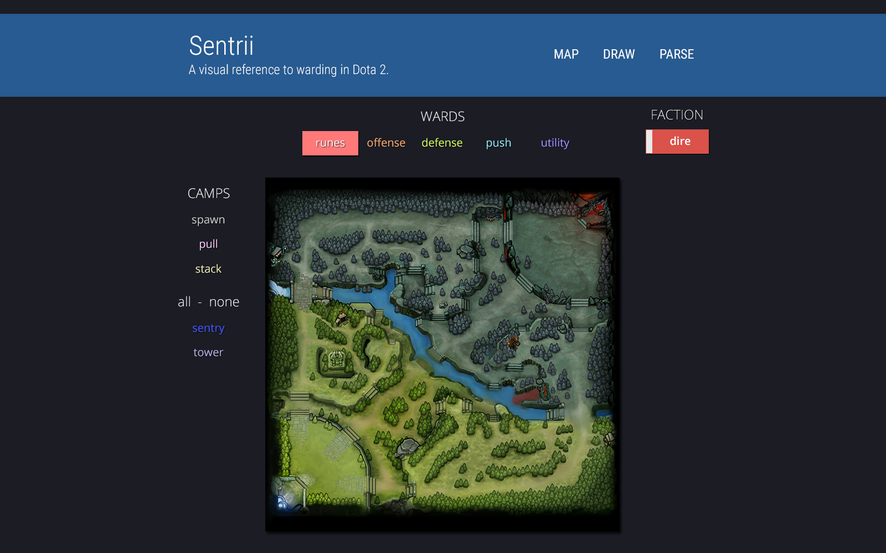

# Sentrii
>An interactive warding and support reference for DOTA 2

### Mockup 1

### Mockup 2

### Install
`npm install`

### Build
Needs `gulp` and `gulp-cli` installed globally via `npm` to run Gulp directly from the command line.

##### gulp (default)
Executes `gulp dev` and starts `gulp-livereload`.

##### gulp dev
Bundles `/src` into `/dev`.

##### gulp prod
Bundles `/src` into `/prod`.
